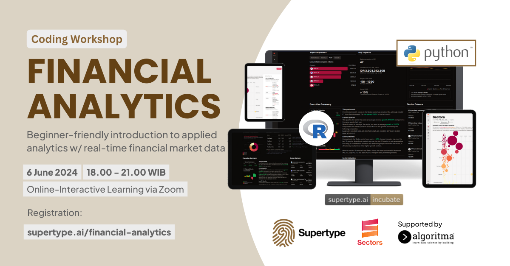

# financial_analytics_workshop
Module list for Sectors's financial analytics workshop

This repository contains working code examples for the financial analytics workshop. The workshop is designed to provide a hands-on experience with financial data analytics using Python and R, feature Sectors API and other open-source libraries.

## Community and Support
- [Sectors API Documentation](https://sectors.app/api)
- [Sectors API Recipe Repository](https://github.com/supertypeai/sectors-kb/tree/main/recipe)
- If you're a [Supertype Fellowship](https://fellowship.supertype.ai) member, please join our [Discord community](https://discord.gg/TAnZMmNS4X) for support and discussions. Any Fellowship+ members should try to maximize the use of the Discord channels for guidance and mentorship. 

## Follow us on Social Media
- [Sectors on LinkedIn](https://www.linkedin.com/showcase/sectorsapp/)
- [Supertype on LinkedIn](https://www.linkedin.com/company/supertype-ai)
- [Sectors on Instagram](https://www.instagram.com/sectorsapp/)
- Also sign up to [Sectors Newsletters](https://sectors.app) for product roadmap, future workshops, and updates. We hate spam and promise to keep your email safe.
